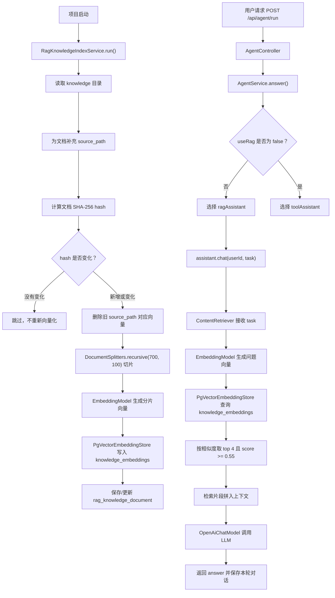

# RAG 功能实现流程详解

本文用于对照当前项目代码阅读 RAG 功能，重点梳理数据如何读取、切片、向量化、入库、对比、检索、取出，以及最后如何交给大模型生成回答。

## 1. RAG 在项目中的整体位置

当前项目里，RAG 不是一个单独接口，而是集成在 `ragAssistant` 这条调用链中。

用户请求入口：

```text
POST /api/agent/run
```

主要调用链：

```text
AgentController
  -> AgentService.answer(...)
    -> 根据 useRag 选择 ragAssistant 或 toolAssistant
      -> ragAssistant.chat(userId, task)
        -> LangChain4j 自动执行 RAG 检索
        -> 将检索到的知识片段拼入本轮上下文
        -> 调用 LLM 生成 answer
    -> ConversationMemoryService.recordExchange(...) 保存本轮问答
```

相关代码：

- `src/main/java/com/antropath/minimalagent/api/AgentController.java`
- `src/main/java/com/antropath/minimalagent/agent/AgentService.java`
- `src/main/java/com/antropath/minimalagent/agent/Assistant.java`
- `src/main/java/com/antropath/minimalagent/agent/KnowledgeBaseConfig.java`

## 2. RAG 分为两条线

项目里的 RAG 要分成两条线看：

```text
资料入库线：
knowledge 目录
  -> 读取文件
  -> 切片
  -> 向量化
  -> 写入 pgvector
  -> 记录文件 hash

用户查询线：
用户问题 task
  -> 问题向量化
  -> pgvector 相似度检索
  -> 取出命中的文本片段
  -> 拼给 LLM
  -> LLM 生成回答
```

这也是为什么你在用户查询时没有看到直接调用 `rag` 包下的类。

`rag` 包主要负责**资料入库和同步**。

用户提问时的向量查询，主要由 LangChain4j 的 `EmbeddingStoreContentRetriever` 自动完成。

## 3. 配置入口：`KnowledgeBaseConfig`

RAG 的核心配置在：

```text
src/main/java/com/antropath/minimalagent/agent/KnowledgeBaseConfig.java
```

### 3.1 配置 Embedding 模型

```java
@Bean
public EmbeddingModel embeddingModel() {
    return OpenAiEmbeddingModel.builder()
            .baseUrl(embeddingBaseUrl)
            .apiKey(embeddingApiKey)
            .modelName(embeddingModelName)
            .logRequests(true)
            .logResponses(true)
            .build();
}
```

作用：

- 把知识文本切片转换成向量。
- 把用户问题转换成查询向量。
- 当前配置读取自 `application.yml`：

```yaml
langchain4j:
  open-ai:
    embedding-model:
      base-url: https://dashscope.aliyuncs.com/compatible-mode/v1
      api-key: ${OPENAI_API_KEY:}
      model-name: text-embedding-v4
```

注意：Embedding 模型不是用来直接回答问题的，它负责把文本变成一组数字向量。

### 3.2 配置向量库 `PgVectorEmbeddingStore`

```java
@Bean
public PgVectorEmbeddingStore embeddingStore(EmbeddingModel embeddingModel) {
    PgVectorEmbeddingStore store = PgVectorEmbeddingStore.builder()
            .host(pgvectorHost)
            .port(pgvectorPort)
            .database(pgvectorDatabase)
            .user(pgvectorUsername)
            .password(pgvectorPassword)
            .table(pgvectorTable)
            .dimension(embeddingModel.dimension())
            .createTable(true)
            .build();
    return store;
}
```

作用：

- 连接 PostgreSQL + pgvector。
- 指定向量表，默认是 `knowledge_embeddings`。
- 使用 `embeddingModel.dimension()` 确定向量维度。
- `createTable(true)` 表示如果向量表不存在，LangChain4j 会尝试创建。

对应配置：

```yaml
rag:
  pgvector:
    host: ${RAG_PGVECTOR_HOST:${DB_HOST:localhost}}
    port: ${RAG_PGVECTOR_PORT:${DB_PORT:5432}}
    database: ${RAG_PGVECTOR_DATABASE:${DB_NAME:agentdemo}}
    username: ${RAG_PGVECTOR_USERNAME:${DB_USERNAME:postgres}}
    password: ${RAG_PGVECTOR_PASSWORD:${DB_PASSWORD:}}
    table: ${RAG_PGVECTOR_TABLE:knowledge_embeddings}
```

所以 LangChain4j 知道“去哪里查”，是因为这里已经配置了数据库地址、库名、用户名、密码和表名。

### 3.3 配置 RAG 查询器 `ContentRetriever`

```java
@Bean
public ContentRetriever knowledgeContentRetriever(EmbeddingModel embeddingModel,
                                                  PgVectorEmbeddingStore embeddingStore) {
    return EmbeddingStoreContentRetriever.builder()
            .embeddingStore(embeddingStore)
            .embeddingModel(embeddingModel)
            .maxResults(4)
            .minScore(0.55)
            .build();
}
```

作用：

- 接收用户问题。
- 用 `embeddingModel` 把问题转成向量。
- 用 `embeddingStore` 去 `knowledge_embeddings` 表里做相似度检索。
- 最多返回 4 条结果。
- 相似度低于 `0.55` 的结果不返回。

这段就是 RAG 查询的核心。

## 4. RAG Assistant 如何接入检索器

```java
@Bean("ragAssistant")
public Assistant ragAssistant(...) {
    return AiServices.builder(Assistant.class)
            .chatModel(chatModel)
            .chatMemoryProvider(chatMemoryProvider)
            .contentRetriever(knowledgeContentRetriever)
            .inputGuardrails(promptInjectionInputGuardrail)
            .outputGuardrails(responseSanityOutputGuardrail)
            .outputGuardrailsConfig(outputGuardrailsConfig)
            .systemMessageProvider(userId -> buildRagSystemMessage((String) userId, conversationMemoryService))
            .build();
}
```

关键是这一行：

```java
.contentRetriever(knowledgeContentRetriever)
```

它告诉 LangChain4j：

> 这个 assistant 在回答用户问题前，需要先使用 `knowledgeContentRetriever` 做知识库检索。

所以当调用：

```java
assistant.chat(request.userId(), request.task());
```

如果当前选择的是 `ragAssistant`，LangChain4j 会自动使用 `contentRetriever` 去做 RAG 检索。

## 5. 请求入口如何选择 RAG

在 `AgentService` 中：

```java
public String answer(AgentRequest request) {
    Assistant assistant = Boolean.FALSE.equals(request.useRag()) ? toolAssistant : ragAssistant;
    String answer = assistant.chat(request.userId(), request.task());
    conversationMemoryService.recordExchange(request.userId(), request.task(), answer);
    return answer;
}
```

含义：

- `useRag = false`：使用 `toolAssistant`，走工具调用链路。
- `useRag = true` 或没有传：使用 `ragAssistant`，走知识库问答链路。

也就是说，RAG 是否启用由请求参数 `useRag` 决定。

示例请求：

```json
{
  "userId": "1",
  "useRag": true,
  "task": "你的问题"
}
```

## 6. 资料入库线：读取、切片、向量化、写入

资料入库由这个类负责：

```text
src/main/java/com/antropath/minimalagent/rag/RagKnowledgeIndexService.java
```

这个类实现了：

```java
public class RagKnowledgeIndexService implements ApplicationRunner
```

所以 Spring Boot 项目启动后，会自动执行：

```java
@Override
public void run(ApplicationArguments args) {
    synchronizeKnowledgeBase();
}
```

也就是说，项目启动时会自动同步知识库。

### 6.1 知识库目录

```java
public RagKnowledgeIndexService(@Value("${rag.knowledge-path:knowledge}") String knowledgePath, ...)
```

默认读取：

```text
knowledge
```

也可以通过配置修改：

```yaml
rag:
  knowledge-path: knowledge
```

### 6.2 构建入库器 `EmbeddingStoreIngestor`

构造方法里创建了 `ingestor`：

```java
this.ingestor = EmbeddingStoreIngestor.builder()
        .documentSplitter(DocumentSplitters.recursive(700, 100))
        .embeddingModel(embeddingModel)
        .embeddingStore(embeddingStore)
        .build();
```

这里做了三件事：

- `DocumentSplitters.recursive(700, 100)`：把文档切成片段。
- `embeddingModel`：把每个片段转成向量。
- `embeddingStore`：把文本片段和向量写入 pgvector。

参数含义：

- `700`：每个分片的大致长度。
- `100`：相邻分片之间保留一定重叠内容。

为什么要重叠？

因为一句完整语义可能刚好跨越两个分片，如果完全硬切，检索时可能丢失上下文。保留重叠能提高命中质量。

### 6.3 读取知识文件

```java
List<Document> rawDocuments = FileSystemDocumentLoader.loadDocumentsRecursively(knowledgePath);
```

作用：

- 递归读取 `knowledge` 目录下的文件。
- 转成 LangChain4j 的 `Document` 对象。
- 每个 `Document` 包含正文和元数据。

如果目录不存在：

```java
if (!Files.exists(knowledgePath)) {
    cleanupAllIndexedDocuments();
    return;
}
```

如果目录为空：

```java
if (rawDocuments.isEmpty()) {
    cleanupAllIndexedDocuments();
    return;
}
```

这两个场景都会清理已经入库的旧知识。

### 6.4 给文档补充 source_path

```java
Map<String, Document> currentDocuments = rawDocuments.stream()
        .map(this::enrichWithSourcePath)
        .filter(Objects::nonNull)
        .collect(Collectors.toMap(
                document -> document.metadata().getString(SOURCE_PATH_KEY),
                Function.identity(),
                (left, right) -> left,
                LinkedHashMap::new));
```

这里会给每个文档补充：

```java
private static final String SOURCE_PATH_KEY = "source_path";
```

`source_path` 很重要，因为后面删除、更新向量时，需要知道这些向量来自哪个文件。

### 6.5 计算文件内容 hash

```java
String contentHash = hash(document.text());
```

项目使用 SHA-256 计算文档内容 hash：

```java
MessageDigest digest = MessageDigest.getInstance("SHA-256");
byte[] bytes = digest.digest(text.getBytes(StandardCharsets.UTF_8));
```

这个 hash 的作用是判断文件内容有没有变化。

如果文件内容没变：

```java
if (existing != null && contentHash.equals(existing.getContentHash())) {
    continue;
}
```

就跳过，不重复切片、不重复向量化、不重复入库。

这就是你当前项目“不必每次启动都重新向量化”的核心逻辑。

### 6.6 文件变化时如何处理

如果文件已经存在，但是 hash 变了：

```java
if (existing != null) {
    removeVectorsForSource(sourcePath);
}
ingestDocument(document, sourcePath, contentHash);
```

流程是：

1. 先删除这个文件原来的所有向量。
2. 再重新切片。
3. 再重新向量化。
4. 再写入向量表。
5. 更新 `rag_knowledge_document` 表里的 hash。

删除旧向量靠的是：

```java
private void removeVectorsForSource(String sourcePath) {
    embeddingStore.removeAll(MetadataFilterBuilder.metadataKey(SOURCE_PATH_KEY).isEqualTo(sourcePath));
}
```

这里按 `source_path` 删除，所以入库时保留元数据非常关键。

### 6.7 真正入库的方法

```java
private void ingestDocument(Document document, String sourcePath, String contentHash) {
    Document enriched = enrichDocument(document, sourcePath, contentHash);
    ingestor.ingest(enriched);

    RagKnowledgeDocument record = repository.findBySourcePath(sourcePath)
            .orElseGet(() -> new RagKnowledgeDocument(sourcePath, contentHash));
    record.updateContentHash(contentHash);
    repository.save(record);

    log.info("Indexed knowledge document: {}", sourcePath);
}
```

这里最关键的是：

```java
ingestor.ingest(enriched);
```

LangChain4j 内部会执行：

```text
Document
  -> DocumentSplitter 切片
  -> TextSegment
  -> EmbeddingModel 生成向量
  -> EmbeddingStore 写入 pgvector
```

同时项目自己维护一张控制表：

```text
rag_knowledge_document
```

用来记录：

- 哪个文件已经入库。
- 文件内容 hash 是多少。
- 最近索引时间是什么。

## 7. 两张表分别做什么

### 7.1 `knowledge_embeddings`

这是向量表，由 `PgVectorEmbeddingStore` 使用。

它保存的是：

- 文本分片。
- 分片对应的 embedding 向量。
- 分片元数据，比如 `source_path`、`content_hash`。

这张表用于用户提问时的相似度检索。

### 7.2 `rag_knowledge_document`

这是项目自己定义的 JPA 表，对应：

```text
src/main/java/com/antropath/minimalagent/rag/RagKnowledgeDocument.java
```

字段包括：

```java
private Long id;
private String sourcePath;
private String contentHash;
private LocalDateTime indexedAt;
```

作用：

- 记录一个知识文件是否已经入库。
- 记录文件内容 hash。
- 用于判断下次启动时是否需要重新向量化。

这张表不直接参与向量相似度检索，它主要用于同步控制。

## 8. 用户查询线：向量化、对比、取出

当用户传：

```json
{
  "userId": "1",
  "useRag": true,
  "task": "请解释项目里的RAG流程"
}
```

会走下面流程。

### 8.1 进入 Controller

```java
@PostMapping("/run")
public AgentResponse run(@Valid @RequestBody AgentRequest request) {
    return new AgentResponse(agentService.answer(request));
}
```

### 8.2 选择 `ragAssistant`

```java
Assistant assistant = Boolean.FALSE.equals(request.useRag()) ? toolAssistant : ragAssistant;
```

只要 `useRag` 不是 `false`，就会选择 `ragAssistant`。

### 8.3 调用 `chat`

```java
String answer = assistant.chat(request.userId(), request.task());
```

接口定义：

```java
public interface Assistant {
    String chat(@MemoryId String userId, @UserMessage String task);
}
```

这里：

- `@MemoryId` 告诉 LangChain4j：第一个参数是记忆 ID。
- `@UserMessage` 告诉 LangChain4j：第二个参数是用户消息。

所以 `task` 会成为本轮 RAG 检索的问题来源。

### 8.4 LangChain4j 自动执行检索

因为 `ragAssistant` 注册了：

```java
.contentRetriever(knowledgeContentRetriever)
```

所以 LangChain4j 会自动调用 `knowledgeContentRetriever`。

内部逻辑可以理解为：

```text
用户问题 task
  -> embeddingModel.embed(task)
  -> 得到问题向量
  -> embeddingStore.findRelevant(...)
  -> 在 knowledge_embeddings 中做相似度搜索
  -> 返回 topK 文本片段
```

这里的 topK 和阈值来自：

```java
.maxResults(4)
.minScore(0.55)
```

也就是说：

- 最多取 4 个最相似分片。
- 相似度低于 0.55 的分片会被过滤掉。

### 8.5 什么叫“对比”

RAG 查询中的“对比”不是字符串包含判断，也不是数据库 `like` 查询。

它对比的是向量相似度。

流程是：

```text
用户问题 -> 向量 A
知识分片 -> 向量 B、C、D、E...
计算 A 和每个知识向量之间的距离或相似度
选择最相似的若干条
```

比如用户问：

```text
这个项目的记忆功能怎么实现？
```

Embedding 模型会把这句话转成向量。

向量库里每个知识片段也已经提前转成向量。

pgvector 会根据向量距离找到语义最接近的片段。

所以即使用户问题和原文不是完全一样，只要语义接近，也有机会命中。

### 8.6 取出的是什么

取出的不是整个文件，而是入库时切好的文本片段。

也就是：

```text
TextSegment
```

每个 `TextSegment` 通常包含：

- 分片文本。
- 分片元数据。
- 相似度分数。

LangChain4j 会把这些检索到的片段作为上下文拼进本轮大模型请求。

## 9. 检索结果如何交给 LLM

最终发给 LLM 的内容可以理解为几部分：

```text
系统提示词
  + 用户历史记忆摘要
  + 用户当前问题
  + RAG 检索到的知识片段
```

你代码里系统提示词来自：

```java
.systemMessageProvider(userId -> buildRagSystemMessage((String) userId, conversationMemoryService))
```

其中：

```java
String memoryContext = conversationMemoryService.buildMemoryContext(userId);
```

负责把历史对话摘要拼进去。

RAG 片段不是你手动字符串拼接的，而是 LangChain4j 在 `contentRetriever` 执行后自动加入到模型上下文中。

## 10. 完整流程图



## 11. 为什么查询时没有调用 `rag` 包

这是一个容易困惑的点。

你的 `rag` 包负责：

```text
知识文件同步
文件 hash 对比
旧向量删除
新内容切片
新向量入库
索引记录维护
```

而用户提问时，负责查询的是：

```text
EmbeddingStoreContentRetriever
  -> EmbeddingModel
  -> PgVectorEmbeddingStore
```

所以查询时看不到显式调用：

```java
RagKnowledgeIndexService.xxx()
```

这是正常的。

它们的关系是：

```text
RagKnowledgeIndexService 负责提前把知识准备好。
EmbeddingStoreContentRetriever 负责用户提问时去查准备好的知识。
```

## 12. 如何验证是否真的入库和检索

### 12.1 查看知识文件同步记录

查询控制表：

```sql
select id, source_path, content_hash, indexed_at
from rag_knowledge_document
order by indexed_at desc;
```

如果这里有数据，说明项目已经识别并记录了知识文件。

### 12.2 查看向量表数量

查询向量表：

```sql
select count(*) from knowledge_embeddings;
```

如果数量大于 0，说明分片向量已经写入 pgvector。

通常一个知识文件会生成多个向量记录，因为文件会被切成多个分片。

### 12.3 查看启动日志

项目启动时可以关注日志：

```text
Indexed knowledge document: ...
RAG knowledge base synchronized. updated=..., removed=..., total=...
RAG knowledge base is already up to date. documents=...
```

如果看到 `already up to date`，说明 hash 没变，本次没有重复向量化。

## 13. 一句话总结

当前项目的 RAG 实现可以总结为：

**启动时由 `RagKnowledgeIndexService` 把 `knowledge` 目录里的资料切片、向量化并写入 pgvector；用户提问时由 `EmbeddingStoreContentRetriever` 把问题向量化，在 `knowledge_embeddings` 里做相似度检索，取出最相关的文本片段，交给 `ragAssistant` 和 LLM 生成最终回答。**

