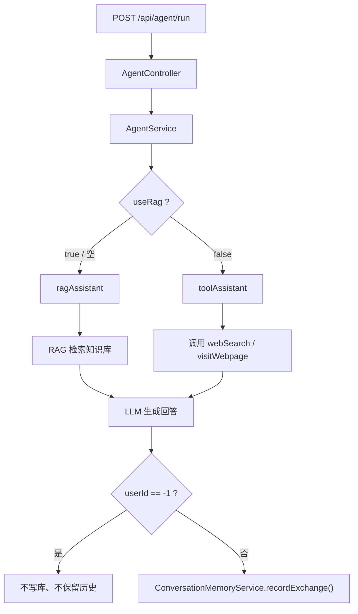

# Agent RAG、记忆与工具调用说明

这份笔记记录本项目目前已经实现的三块能力：

1. 是否使用 RAG 由请求参数决定
2. `userId = -1` 时不记录历史消息
3. `webSearch` 工具的故障、排查和修复

---

## 1. 功能总览

当前接口接收一个请求体：

- `userId`
- `useRag`
- `task`

含义很直接：

- `useRag = true` 或不传：走 RAG 问答
- `useRag = false`: 走 function calling / 工具调用
- `userId = -1`: 该请求不写入历史消息，也不保留会话记忆

对应入口主要在：

- [AgentController.java](C:/Users/86187/Desktop/老桌面/学习笔记/Java学习/大三暑假/agent_demo/springboot-refactor/src/main/java/com/antropath/minimalagent/api/AgentController.java)
- [AgentRequest.java](C:/Users/86187/Desktop/老桌面/学习笔记/Java学习/大三暑假/agent_demo/springboot-refactor/src/main/java/com/antropath/minimalagent/api/AgentRequest.java)
- [AgentService.java](C:/Users/86187/Desktop/老桌面/学习笔记/Java学习/大三暑假/agent_demo/springboot-refactor/src/main/java/com/antropath/minimalagent/agent/AgentService.java)

---

## 2. 整体流程



---

## 3. 为什么要加 `useRag`

项目里同时存在两种能力：

- RAG：适合知识库问答
- 工具调用：适合联网搜索、网页访问

它们不是一回事，所以我把选择权交给请求参数，而不是固定写死在代码里。

### 代码上的实现

在 `AgentService` 里分流：

```java
Assistant assistant = Boolean.FALSE.equals(request.useRag()) ? toolAssistant : ragAssistant;
String answer = assistant.chat(request.userId(), request.task());
```

这意味着：

- 默认偏向 RAG
- 只有明确传 `useRag=false` 时，才进入工具调用模式

---

## 4. RAG 是怎么工作的

RAG 的核心配置在：

- [KnowledgeBaseConfig.java](C:/Users/86187/Desktop/老桌面/学习笔记/Java学习/大三暑假/agent_demo/springboot-refactor/src/main/java/com/antropath/minimalagent/agent/KnowledgeBaseConfig.java)

### 4.1 知识从哪里来

知识来源是本地目录：

```yaml
rag:
  knowledge-path: knowledge
```

也就是说，把 `.md`、`.txt` 等文件放进 `knowledge/`，启动时就会被读入。

### 4.2 文档怎么变成向量

启动时会做这几步：

1. 递归读取 `knowledge/` 里的文档
2. 用 `DocumentSplitters.recursive(700, 100)` 切片
3. 用 embedding 模型把每个片段转成向量
4. 存进 `InMemoryEmbeddingStore`

### 4.3 查询时怎么匹配

用户提问后：

1. 问题也会转成向量
2. 去向量库里找最相近的片段
3. 取前几个结果
4. 把“问题 + 检索片段”一起交给模型生成回答

所以模型看到的不是“纯问题”，而是“问题 + 检索到的资料”。

---

## 5. 记忆是怎么做的

记忆相关代码在：

- [ConversationMemoryService.java](C:/Users/86187/Desktop/老桌面/学习笔记/Java学习/大三暑假/agent_demo/springboot-refactor/src/main/java/com/antropath/minimalagent/memory/ConversationMemoryService.java)

### 5.1 存储结构

历史消息存到 PostgreSQL，对应表由 JPA 自动维护。

每次请求都会记录两条：

- 用户消息
- 助手回复

### 5.2 读取方式

会按 `userId` 读取最近 12 条消息，拼成上下文后塞进系统提示词里。

### 5.3 `userId = -1` 的特殊规则

我给匿名请求加了特殊处理：

- 不读取历史
- 不写入数据库
- 不保留跨请求的会话记忆

这适合临时测试，不会污染真实用户数据。

---

## 6. `webSearch` 为什么一开始不好用

这个问题其实不是“工具不存在”，而是“搜索源不稳定”。

### 6.1 现象

`useRag=false` 后，模型确实调用了 `webSearch`，但有时会超时，最后返回：

- `Search failed: Connect timed out`
- 或者工具链返回失败后，模型自己兜底回答

### 6.2 原因

最初的实现只依赖单一搜索源，网络抖动或搜索页反爬时就容易失败。

另外，function calling 不是“强制调用”，而是：

- 模型判断要不要调用工具
- 调了以后，框架执行工具方法
- 工具失败时，模型可能继续生成兜底回答

### 6.3 现在的修复

我把搜索改成了多源兜底：

1. Bing
2. DuckDuckGo
3. 百度

对应代码在：

- [MinimalAgentTools.java](C:/Users/86187/Desktop/老桌面/学习笔记/Java学习/大三暑假/agent_demo/springboot-refactor/src/main/java/com/antropath/minimalagent/agent/MinimalAgentTools.java)

同时我也加了日志：

- `webSearch called with query=...`
- `visitWebpage called with url=...`

这样一眼就能看出来工具到底有没有被调用。

---

## 7. 工具调用的实际流程

工具调用走的是另一条链路：

1. 请求里传 `useRag=false`
2. `AgentService` 选择 `toolAssistant`
3. `AiServices` 把 `webSearch`、`visitWebpage` 暴露给模型
4. 模型决定是否调用工具
5. 工具方法执行后，把结果回传给模型
6. 模型再组织最终答案

所以你日志里看到的流程通常是：

- 模型先发起 `tool_calls`
- Java 层执行 `webSearch`
- 再把工具结果喂回模型
- 模型输出最终回答

---

## 8. 这个项目现在的几个关键点

- RAG 和工具调用是分开的
- 是否走 RAG 由 `useRag` 决定
- `userId = -1` 只做临时请求，不留历史
- `knowledge/` 是本地知识库入口
- `InMemoryEmbeddingStore` 适合学习和 demo，但重启会丢向量

---

## 9. 我踩过的几个坑

### 9.1 `@MemoryId` 没配 `ChatMemoryProvider`

一开始启动报错，是因为 LangChain4j 要求 `@MemoryId` 对应的 `Assistant` 必须配置 `ChatMemoryProvider`。

### 9.2 工具调用返回 500

后来又遇到 `messages cannot be null or empty`，根因是匿名用户的记忆实现返回了空消息列表，工具链第二轮组包时炸了。

### 9.3 `webSearch` 超时

搜索不是模型问题，是外部搜索页不稳定，所以后来改成了多源兜底。

---

## 10. 一句话总结

这个项目现在已经变成了一个很清楚的教学型 AI Agent：

- 知识库问答靠 RAG
- 联网查询靠工具调用
- 历史消息靠 PostgreSQL
- 匿名请求不落库

它不是“一个模型包打天下”，而是程序负责流程，模型负责生成。

