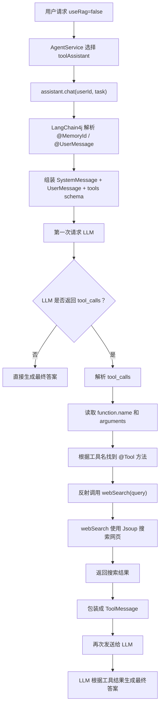

# webSearch 工具调用

本文整理当前项目中 `webSearch` 工具调用的完整链路，重点说明：

- `@Tool` 注解如何发挥作用
- LLM 如何知道可以调用 `webSearch`
- LLM 返回的 `tool_calls` 里包含什么
- LangChain4j 如何判断需要调用函数
- Java 方法 `webSearch(String query)` 如何被真正执行
- 工具结果如何再次交给 LLM 生成最终回答

## 1. 整体链路

当请求中：

```json
{
  "userId": "-1",
  "useRag": false,
  "task": "查询一下百度网站"
}
```

由于：

```java
Assistant assistant = Boolean.FALSE.equals(request.useRag()) ? toolAssistant : ragAssistant;
```

`useRag = false` 时会选择：

```text
toolAssistant
```

整体链路是：

```text
用户请求
  -> AgentController
  -> AgentService.answer(...)
  -> 选择 toolAssistant
  -> assistant.chat(userId, task)
  -> LangChain4j 组装用户消息、系统提示词、工具定义
  -> 第一次请求 LLM
  -> LLM 返回 tool_calls
  -> LangChain4j 解析 tool_calls
  -> 反射调用 MinimalAgentTools.webSearch(query)
  -> 工具返回搜索结果
  -> LangChain4j 把工具结果再发给 LLM
  -> LLM 生成最终自然语言答案
  -> AgentService 保存对话并返回
```

## 2. Tool Agent 是如何配置的

相关代码在 `KnowledgeBaseConfig`：

```java
@Bean("toolAssistant")
public Assistant toolAssistant(OpenAiChatModel chatModel,
                               MinimalAgentTools minimalAgentTools,
                               ChatMemoryProvider chatMemoryProvider,
                               PromptInjectionInputGuardrail promptInjectionInputGuardrail,
                               ResponseSanityOutputGuardrail responseSanityOutputGuardrail,
                               OutputGuardrailsConfig outputGuardrailsConfig,
                               ConversationMemoryService conversationMemoryService) {
    return AiServices.builder(Assistant.class)
            .chatModel(chatModel)
            .chatMemoryProvider(chatMemoryProvider)
            .tools(minimalAgentTools)
            .inputGuardrails(promptInjectionInputGuardrail)
            .outputGuardrails(responseSanityOutputGuardrail)
            .outputGuardrailsConfig(outputGuardrailsConfig)
            .systemMessageProvider(userId -> buildToolSystemMessage((String) userId, conversationMemoryService))
            .build();
}
```

这里最关键的是：

```java
.tools(minimalAgentTools)
```

它把 `MinimalAgentTools` 这个工具类交给 LangChain4j。

LangChain4j 会扫描这个对象中的方法，找到带有 `@Tool` 注解的方法，并把它们注册成 LLM 可以调用的工具。

## 3. `@Tool` 注解如何发挥作用

工具定义在 `MinimalAgentTools`：

```java
@Tool("Search the web and return a short list of relevant results with titles, URLs, and snippets.")
public String webSearch(String query) {
    log.info("webSearch called with query={}", query);
    List<String> attempts = List.of(
            searchBing(query),
            searchDuckDuckGo(query),
            searchBaidu(query)
    );
    for (String result : attempts) {
        if (result != null && !result.isBlank() && !result.startsWith("Search failed:")) {
            return result;
        }
    }
    return attempts.get(0);
}
```

`@Tool` 的作用不是直接执行方法。

它的作用是：

```text
告诉 LangChain4j：
这个 Java 方法可以暴露给大模型当工具使用。
```

LangChain4j 在构建 `toolAssistant` 时，会读取：

- 方法名：`webSearch`
- 方法描述：`Search the web and return...`
- 方法参数：`String query`
- 方法返回值：`String`

然后生成类似下面的工具描述：

```json
{
  "type": "function",
  "function": {
    "name": "webSearch",
    "description": "Search the web and return a short list of relevant results with titles, URLs, and snippets.",
    "parameters": {
      "type": "object",
      "properties": {
        "query": {
          "type": "string"
        }
      },
      "required": ["query"]
    }
  }
}
```

这个工具描述会在请求 LLM 时一起发送。

所以模型知道：

```text
现在有一个工具叫 webSearch。
它需要一个 query 参数。
它可以用来搜索网页并返回标题、链接、摘要。
```

## 4. 第一次请求 LLM 时发送了什么

当执行：

```java
String answer = assistant.chat(request.userId(), request.task());
```

LangChain4j 会组装第一次请求。

大致包含：

```text
SystemMessage:
  你是一个中文学习助手，当前工作模式是工具调用。
  只要问题涉及事实查询、联网搜索、网页内容总结，就必须先调用工具。
  优先使用 webSearch；如果需要网页正文，再调用 visitWebpage。

UserMessage:
  查询一下百度网站

Tools:
  webSearch(query)
  visitWebpage(url)
```

注意：

```text
第一次请求时还没有执行 webSearch。
```

这一步只是把工具能力告诉模型，让模型自己判断是否需要调用工具。

## 5. LLM 返回 `tool_calls`

当模型判断用户问题需要搜索时，它不会直接返回普通回答，而是返回工具调用请求。

典型返回结构类似：

```json
{
  "choices": [
    {
      "message": {
        "role": "assistant",
        "content": "",
        "tool_calls": [
          {
            "id": "call_xxx",
            "type": "function",
            "function": {
              "name": "webSearch",
              "arguments": "{\"query\":\"百度网站\"}"
            }
          }
        ]
      },
      "finish_reason": "tool_calls"
    }
  ]
}
```

这里有两个关键信号：

```text
message.tool_calls 不为空
finish_reason = tool_calls
```

LangChain4j 解析模型响应时，看到 `tool_calls`，就知道：

```text
这不是最终回答，而是模型要求调用工具。
```

## 6. `webSearch` 怎么知道要查什么

`webSearch` 本身不会从用户原始问题里截取关键词。

它拿到的查询内容来自 LLM 返回的工具参数：

```json
"arguments": "{\"query\":\"百度网站\"}"
```

也就是说，LLM 返回的不只是：

```text
我要调用 webSearch
```

还会返回：

```text
调用 webSearch 时要传入 query = 百度网站
```

LangChain4j 会解析：

```text
name = webSearch
arguments = {"query": "百度网站"}
```

然后调用：

```java
webSearch("百度网站")
```

所以 `webSearch(String query)` 中的 `query` 参数，是由 LLM 在 `tool_calls.function.arguments` 里生成的。

## 7. LangChain4j 如何真正调用 Java 方法

在构建 `toolAssistant` 时：

```java
.tools(minimalAgentTools)
```

LangChain4j 已经扫描过 `minimalAgentTools`。

它会建立类似下面的映射关系：

```text
工具名 webSearch
  -> MinimalAgentTools.webSearch(String query)

工具名 visitWebpage
  -> MinimalAgentTools.visitWebpage(String url)
```

可以理解成内部有一个映射表：

```java
Map<String, ToolExecutor> toolExecutors = Map.of(
    "webSearch", executorForWebSearch,
    "visitWebpage", executorForVisitWebpage
);
```

当 LLM 返回：

```json
{
  "name": "webSearch",
  "arguments": "{\"query\":\"百度网站\"}"
}
```

LangChain4j 会执行：

```text
1. 读取工具名 webSearch
2. 根据工具名找到对应 ToolExecutor
3. 解析 arguments JSON
4. 将 query 映射到 Java 方法参数
5. 通过反射调用 MinimalAgentTools.webSearch("百度网站")
```

伪代码可以理解成：

```java
Method method = MinimalAgentTools.class.getMethod("webSearch", String.class);
Object result = method.invoke(minimalAgentTools, "百度网站");
```

真实框架实现会更复杂，还会处理：

- 参数类型转换
- 参数缺失
- 工具执行异常
- 多个工具调用
- 工具调用轮次限制
- 工具结果包装

但核心思想就是：

```text
根据 tool_calls 里的 name 找方法，
根据 arguments 映射参数，
再反射执行 Java 方法。
```

## 8. `webSearch` 方法内部做了什么

当前项目的 `webSearch` 会依次尝试：

```java
List<String> attempts = List.of(
        searchBing(query),
        searchDuckDuckGo(query),
        searchBaidu(query)
);
```

也就是：

```text
Bing
DuckDuckGo
Baidu
```

每个搜索方法会拼出搜索 URL：

```java
"https://www.bing.com/search?q=" + encode(query)
```

或者：

```java
"https://duckduckgo.com/html/?q=" + encode(query)
```

或者：

```java
"https://www.baidu.com/s?wd=" + encode(query)
```

然后用 Jsoup 请求页面：

```java
Document document = Jsoup.connect(url)
        .userAgent("Mozilla/5.0")
        .timeout(15_000)
        .get();
```

再用 CSS selector 提取搜索结果：

```java
Elements results = document.select(resultSelector);
```

最终返回：

```text
[标题](链接)
摘要

[标题](链接)
摘要
```

如果第一个搜索源失败，会继续尝试下一个搜索源。

## 9. 工具结果不是最终答案

`webSearch(...)` 返回的字符串不会直接作为接口最终返回。

它会先被 LangChain4j 包装成工具结果消息。

大致类似：

```json
{
  "role": "tool",
  "tool_call_id": "call_xxx",
  "content": "搜索结果..."
}
```

然后 LangChain4j 会把下面这些消息再次发送给 LLM：

```text
SystemMessage:
  工具模式系统提示词

UserMessage:
  查询一下百度网站

AssistantMessage:
  tool_calls: webSearch({"query":"百度网站"})

ToolMessage:
  搜索结果...
```

模型拿到工具结果后，再生成最终自然语言答案。

因此最终用户看到的是：

```text
LLM 根据工具结果整理后的回答
```

不是 `webSearch(...)` 方法原样返回的字符串。

## 10. 如果模型继续调用 `visitWebpage`

当前项目还定义了：

```java
@Tool("Visit a webpage and return its readable text content as markdown-like plain text.")
public String visitWebpage(String url) {
    ...
}
```

如果模型认为搜索结果摘要不够，它可以继续返回：

```json
{
  "tool_calls": [
    {
      "function": {
        "name": "visitWebpage",
        "arguments": "{\"url\":\"https://example.com\"}"
      }
    }
  ]
}
```

LangChain4j 会再次执行：

```java
visitWebpage("https://example.com")
```

然后把网页正文结果再回传给 LLM。

这个过程可以多轮发生，直到模型生成最终答案，或者达到框架配置的工具调用轮次限制。

## 11. Tool 调用和 RAG 的区别

RAG 链路：

```text
用户问题
  -> 框架先做向量检索
  -> 把知识片段拼进 UserMessage
  -> 再发给 LLM
```

Tool 链路：

```text
用户问题 + tools schema
  -> 先发给 LLM
  -> LLM 决定是否返回 tool_calls
  -> 框架执行 Java 工具
  -> 工具结果再发给 LLM
  -> LLM 生成最终答案
```

核心差异：

```text
RAG 是框架先查资料。
Tool 是模型先决定要不要调用工具。
```

## 12. 完整流程图



## 13. 一句话总结

`@Tool` 的作用是把 Java 方法声明成 LLM 可见的工具。  
真正的调用过程是：

```text
.tools(minimalAgentTools)
  -> 扫描 @Tool 方法
  -> 生成 tools schema
  -> 发给 LLM
  -> LLM 返回 tool_calls
  -> LangChain4j 解析工具名和参数
  -> 反射调用 Java 方法
  -> 工具结果回传 LLM
  -> LLM 输出最终答案
```

所以 `webSearch` 的本质是：

```text
Java 提供搜索能力，
LLM 决定何时使用，
LangChain4j 负责调度执行。
```

