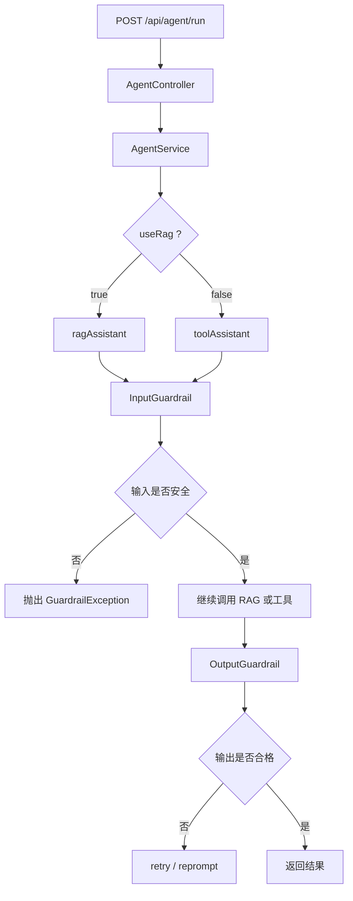

# 护栏机制学习笔记

这份笔记记录本项目里 LangChain4j 护栏机制的实现方式、运行流程，以及它到底是 LangChain4j 做的，还是 LLM 自己做的。

参考资料：

- [LangChain4j Guardrails 官方文档](https://docs.langchain4j.dev/tutorials/guardrails/)
- [LangChain4j Guardrails 中文教程](https://langchain4j.cn/tutorials/guardrails.html)

---

## 1. 护栏是什么

护栏（Guardrails）可以理解成 AI 服务前后的“检查门”。

它不是替代业务逻辑，而是在模型调用前后做约束，常见用途有：

- 检查用户输入是否越界
- 拦截明显的提示词注入
- 检查模型输出是否为空、过短或不符合格式
- 发现异常结果后重试或直接报错

官方文档说明得很明确：护栏是 LangChain4j AI Services 里的高层机制，只能用于 `AiServices`，不能直接挂在裸 `ChatModel` 上。

---

## 2. 本项目里加了什么

当前项目加入了三层相关能力：

1. 输入护栏：`PromptInjectionInputGuardrail`
2. 输出护栏：`ResponseSanityOutputGuardrail`
3. 异常统一处理：`GlobalExceptionHandler`

相关代码：

- [PromptInjectionInputGuardrail.java](C:/Users/86187/Desktop/老桌面/学习笔记/Java学习/大三暑假/agent_demo/springboot-refactor/src/main/java/com/antropath/minimalagent/guardrail/PromptInjectionInputGuardrail.java)
- [ResponseSanityOutputGuardrail.java](C:/Users/86187/Desktop/老桌面/学习笔记/Java学习/大三暑假/agent_demo/springboot-refactor/src/main/java/com/antropath/minimalagent/guardrail/ResponseSanityOutputGuardrail.java)
- [GlobalExceptionHandler.java](C:/Users/86187/Desktop/老桌面/学习笔记/Java学习/大三暑假/agent_demo/springboot-refactor/src/main/java/com/antropath/minimalagent/api/GlobalExceptionHandler.java)
- [KnowledgeBaseConfig.java](C:/Users/86187/Desktop/老桌面/学习笔记/Java学习/大三暑假/agent_demo/springboot-refactor/src/main/java/com/antropath/minimalagent/agent/KnowledgeBaseConfig.java)

---

## 3. 运行流程



---

## 4. 输入护栏怎么做的

输入护栏代码在：

- [PromptInjectionInputGuardrail.java](C:/Users/86187/Desktop/老桌面/学习笔记/Java学习/大三暑假/agent_demo/springboot-refactor/src/main/java/com/antropath/minimalagent/guardrail/PromptInjectionInputGuardrail.java)

核心逻辑是 `validate(...)`：

1. 从请求里提取用户文本
2. 检查是否为空
3. 检查是否超过最大长度
4. 对文本做归一化处理
5. 用预编译正则判断是否命中可疑模式
6. 命中则直接 `fatal(...)`
7. 没命中则 `success()`

### 4.1 代码层面的判断

你这段代码本质上是在做三类规则校验：

- 空输入校验
- 长度校验
- 关键词 / 正则匹配校验

其中可疑模式包括：

- `ignore previous instructions`
- `system prompt`
- `developer message`
- `prompt injection`
- `jailbreak`
- `role: system`

还包含一些中文场景下的变体匹配。

### 4.2 它为什么能拦住

因为 `validate(...)` 返回的不是普通布尔值，而是 `InputGuardrailResult`。

- `success()`：放行，继续后续流程
- `fatal("...")`：判定失败，直接中断调用链

也就是说，这不是“提醒一下模型注意”，而是**直接把请求挡在模型前面**。

---

## 5. 这个原理是 LangChain4j 的，还是 LLM 的

结论很简单：

**这是 LangChain4j 框架层实现的，不是 LLM 自己实现的。**

### 为什么这么说

因为真正做判断的是你 Java 里的 `PromptInjectionInputGuardrail`，而不是模型。

流程是：

1. 用户请求进入 `AiServices`
2. LangChain4j 先执行输入护栏
3. 你的 Java 代码检查文本
4. 如果命中规则，LangChain4j 直接终止请求
5. 如果通过，LangChain4j 才把消息送给 LLM

所以它的本质是：

- **LangChain4j 负责调度**
- **你写的规则负责判定**
- **LLM 只在通过后才参与生成**

### LLM 在这里扮演什么角色

LLM 不负责“拦截”。

LLM 只负责：

- 接收通过护栏的输入
- 根据 RAG / 工具 / 历史消息生成答案

所以护栏不是模型天生的安全能力，而是应用层在模型外面加的一层安全控制。

---

## 6. 输入文本是怎么处理的

`extractText(...)` 会从 `UserMessage` 里取出文本。

处理思路是：

- 如果消息为空，返回空串
- 如果是单段文本，直接取 `singleText()`
- 如果是多内容消息，只提取 `TextContent`

这样做的好处是：

- 不会把图片、文件等非文本内容误当成输入文本
- 能兼容 LangChain4j 的消息结构

然后 `validate(...)` 会做：

```java
String normalized = text.replaceAll("\\s+", " ").toLowerCase(Locale.ROOT);
```

这样能统一空白字符，也能让大小写不影响匹配结果。

---

## 7. 为什么要放在 AiServices 里

在 `KnowledgeBaseConfig.java` 里，护栏是这样接进去的：

- [KnowledgeBaseConfig.java](C:/Users/86187/Desktop/老桌面/学习笔记/Java学习/大三暑假/agent_demo/springboot-refactor/src/main/java/com/antropath/minimalagent/agent/KnowledgeBaseConfig.java)

你会看到：

```java
.inputGuardrails(promptInjectionInputGuardrail)
.outputGuardrails(responseSanityOutputGuardrail)
```

这说明护栏是 AI Service 级别的能力。

换句话说：

- 不是控制器里手动 if/else
- 不是模型 prompt 里“要求自己注意安全”
- 而是 LangChain4j 在调用链上自动插入了校验步骤

---

## 8. 异常为什么没有直接变成 500

如果输入护栏拦截成功，会抛出 `GuardrailException`。

项目里用了统一异常处理：

- [GlobalExceptionHandler.java](C:/Users/86187/Desktop/老桌面/学习笔记/Java学习/大三暑假/agent_demo/springboot-refactor/src/main/java/com/antropath/minimalagent/api/GlobalExceptionHandler.java)

现在护栏错误会返回：

- `422 Unprocessable Entity`

这样前端就能明确知道：

- 不是服务炸了
- 而是输入被安全规则挡住了

---

## 9. 输出护栏在做什么

输出护栏的职责和输入护栏不同。

输入护栏是“先挡住不安全输入”，输出护栏是“检查模型结果像不像正常答案”。

本项目的输出护栏主要用来检查：

- 空输出
- 过短输出
- 明显不完整的输出

如果输出不合格，LangChain4j 可以根据配置重试一次。

这部分配置在：

- [KnowledgeBaseConfig.java](C:/Users/86187/Desktop/老桌面/学习笔记/Java学习/大三暑假/agent_demo/springboot-refactor/src/main/java/com/antropath/minimalagent/agent/KnowledgeBaseConfig.java)

---

## 10. 这套机制的核心理解

你可以把整个链路理解成：

```text
用户输入 -> 输入护栏 -> RAG / 工具调用 -> 输出护栏 -> 返回结果
```

护栏做的是“前置和后置校验”，不是知识检索，也不是记忆存储。

所以它和下面这些东西是不同层次的能力：

- RAG：负责找资料
- 记忆：负责保存上下文
- 工具调用：负责外部能力
- 护栏：负责安全和质量控制

---

## 11. 本项目里的结论

这份实现的本质是：

- **LangChain4j 提供护栏机制**
- **项目自己写规则**
- **模型只负责生成**

所以如果你问“底层原理是不是 LLM 做的”，答案是否定的。

更准确地说：

1. LangChain4j 在 AI Service 调用链里插入护栏
2. 你的 Java 代码按规则判断输入是否可疑
3. 命中就阻止模型调用
4. 没命中才让 LLM 继续工作

---

## 12. 学习时最该记住的点

- 护栏是框架层能力，不是模型本身的能力
- 输入护栏在模型调用前执行
- 输出护栏在模型返回后执行
- `fatal()` 代表拦截
- `success()` 代表放行
- 这套机制适合学习项目，也适合后续做真实应用安全控制

