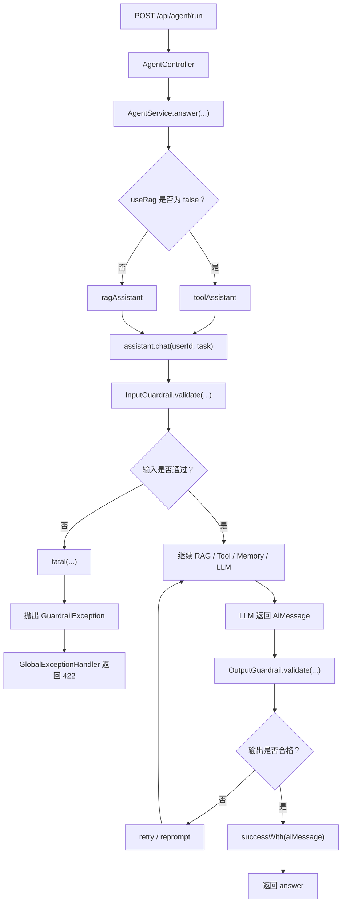

# 护栏机制源码讲解

本文结合当前项目代码，说明 LangChain4j 护栏机制是如何实现和生效的。

项目中护栏主要分成三部分：

```text
输入护栏：
  PromptInjectionInputGuardrail

输出护栏：
  ResponseSanityOutputGuardrail

异常处理：
  GlobalExceptionHandler
```

护栏不是 LLM 自己完成的，而是：

```text
LangChain4j 负责在 AI Service 调用链中调度护栏。
项目自己的 Java 代码负责具体判断规则。
LLM 只负责通过护栏后的生成。
```

## 1. 护栏在整体链路中的位置

正常请求链路是：

```text
用户请求
  -> AgentController
  -> AgentService.answer(...)
  -> assistant.chat(userId, task)
  -> 输入护栏 InputGuardrail
  -> RAG / Tool / Memory / LLM 调用
  -> 输出护栏 OutputGuardrail
  -> 返回 answer
```

也就是说：

- 输入护栏在模型调用之前执行。
- 输出护栏在模型返回之后执行。

如果输入护栏拦截成功，请求不会继续发给 LLM。

## 2. 护栏在哪里接入 Assistant

护栏是在 `KnowledgeBaseConfig` 中接入的。

RAG Agent：

```java
@Bean("ragAssistant")
public Assistant ragAssistant(OpenAiChatModel chatModel,
                              ContentRetriever knowledgeContentRetriever,
                              ChatMemoryProvider chatMemoryProvider,
                              PromptInjectionInputGuardrail promptInjectionInputGuardrail,
                              ResponseSanityOutputGuardrail responseSanityOutputGuardrail,
                              OutputGuardrailsConfig outputGuardrailsConfig,
                              ConversationMemoryService conversationMemoryService) {
    return AiServices.builder(Assistant.class)
            .chatModel(chatModel)
            .chatMemoryProvider(chatMemoryProvider)
            .contentRetriever(knowledgeContentRetriever)
            .inputGuardrails(promptInjectionInputGuardrail)
            .outputGuardrails(responseSanityOutputGuardrail)
            .outputGuardrailsConfig(outputGuardrailsConfig)
            .systemMessageProvider(userId -> buildRagSystemMessage((String) userId, conversationMemoryService))
            .build();
}
```

Tool Agent：

```java
@Bean("toolAssistant")
public Assistant toolAssistant(OpenAiChatModel chatModel,
                               MinimalAgentTools minimalAgentTools,
                               ChatMemoryProvider chatMemoryProvider,
                               PromptInjectionInputGuardrail promptInjectionInputGuardrail,
                               ResponseSanityOutputGuardrail responseSanityOutputGuardrail,
                               OutputGuardrailsConfig outputGuardrailsConfig,
                               ConversationMemoryService conversationMemoryService) {
    return AiServices.builder(Assistant.class)
            .chatModel(chatModel)
            .chatMemoryProvider(chatMemoryProvider)
            .tools(minimalAgentTools)
            .inputGuardrails(promptInjectionInputGuardrail)
            .outputGuardrails(responseSanityOutputGuardrail)
            .outputGuardrailsConfig(outputGuardrailsConfig)
            .systemMessageProvider(userId -> buildToolSystemMessage((String) userId, conversationMemoryService))
            .build();
}
```

关键代码是：

```java
.inputGuardrails(promptInjectionInputGuardrail)
.outputGuardrails(responseSanityOutputGuardrail)
.outputGuardrailsConfig(outputGuardrailsConfig)
```

这表示：

```text
ragAssistant 和 toolAssistant 都会经过同一套输入/输出护栏。
```

所以无论你走 RAG，还是走 WebSearch Tool，只要最终调用的是：

```java
assistant.chat(...)
```

都会触发护栏机制。

## 3. 输入护栏：`PromptInjectionInputGuardrail`

输入护栏代码在：

```text
src/main/java/com/antropath/minimalagent/guardrail/PromptInjectionInputGuardrail.java
```

它实现了 LangChain4j 的接口：

```java
public class PromptInjectionInputGuardrail implements InputGuardrail
```

核心方法是：

```java
@Override
public InputGuardrailResult validate(InputGuardrailRequest request)
```

LangChain4j 在调用 LLM 前，会自动调用这个 `validate(...)` 方法。

### 3.1 提取用户输入

代码：

```java
String text = extractText(request.userMessage());
```

这里的 `request.userMessage()` 是 LangChain4j 传进来的用户消息。

`extractText(...)` 的作用是从 `UserMessage` 中提取文本：

```java
private static String extractText(UserMessage userMessage) {
    if (userMessage == null) {
        return "";
    }
    if (userMessage.hasSingleText()) {
        return userMessage.singleText();
    }
    return userMessage.contents().stream()
            .filter(TextContent.class::isInstance)
            .map(TextContent.class::cast)
            .map(TextContent::text)
            .collect(Collectors.joining(" "))
            .trim();
}
```

它处理了两种情况：

```text
单文本消息：
  直接 userMessage.singleText()

多内容消息：
  只提取 TextContent
```

这样可以避免把图片、文件等非文本内容误当成待检测文本。

### 3.2 空输入检查

```java
if (text.isBlank()) {
    return fatal("输入不能为空。");
}
```

如果用户输入为空，直接返回 `fatal(...)`。

`fatal(...)` 的含义是：

```text
严重失败，终止本次 AI 调用。
```

这一步发生在模型调用前，所以空输入不会被发给 LLM。

### 3.3 长度检查

```java
private static final int MAX_INPUT_LENGTH = 4000;
```

```java
if (text.length() > MAX_INPUT_LENGTH) {
    return fatal("输入内容过长，请精简后再试。");
}
```

如果用户输入超过最大长度，也直接拦截。

这样可以避免：

- 输入过长导致 token 成本过高
- 恶意超长输入拖慢服务
- 模型上下文被无效内容占满

### 3.4 提示词注入检测

项目中定义了一组可疑模式：

```java
private static final Set<Pattern> SUSPICIOUS_PATTERNS = Set.of(
        Pattern.compile("(?i)ignore\\s+(all\\s+)?previous\\s+instructions"),
        Pattern.compile("(?i)system\\s+prompt"),
        Pattern.compile("(?i)developer\\s+message"),
        Pattern.compile("(?i)prompt\\s+injection"),
        Pattern.compile("(?i)jailbreak"),
        Pattern.compile("role\\s*:\\s*(system|developer)")
);
```

这些规则用于识别类似：

```text
ignore previous instructions
system prompt
developer message
prompt injection
jailbreak
role: system
```

检测前会先做文本归一化：

```java
String normalized = text.replaceAll("\\s+", " ").toLowerCase(Locale.ROOT);
```

这一步做了两件事：

```text
把连续空白统一成一个空格
把英文转成小写
```

然后匹配规则：

```java
boolean suspicious = SUSPICIOUS_PATTERNS.stream()
        .anyMatch(pattern -> pattern.matcher(normalized).find());
```

如果命中：

```java
log.warn("Prompt injection blocked: {}", text);
return fatal("检测到疑似提示词注入或越权指令，请换一种方式描述你的问题。");
```

这表示请求被拦截，不会继续进入 RAG、Tool 或 LLM。

### 3.5 放行

如果所有检查都通过：

```java
return success();
```

`success()` 表示：

```text
输入通过检查，可以继续后续 AI 调用链。
```

## 4. 输出护栏：`ResponseSanityOutputGuardrail`

输出护栏代码在：

```text
src/main/java/com/antropath/minimalagent/guardrail/ResponseSanityOutputGuardrail.java
```

它实现：

```java
public class ResponseSanityOutputGuardrail implements OutputGuardrail
```

核心方法是：

```java
@Override
public OutputGuardrailResult validate(OutputGuardrailRequest request)
```

LangChain4j 在 LLM 返回之后，会调用这个方法检查模型输出。

### 4.1 取出模型回答

```java
AiMessage aiMessage = request.responseFromLLM() == null ? null : request.responseFromLLM().aiMessage();
String text = aiMessage == null ? "" : aiMessage.text();
```

这里从模型响应中取出：

```text
AiMessage
```

再从 `AiMessage` 中取出文本：

```text
aiMessage.text()
```

### 4.2 空输出处理

```java
if (text == null || text.isBlank()) {
    log.warn("Empty model response blocked by output guardrail.");
    return reprompt(
            "模型返回了空内容，请基于用户问题和已有上下文重新生成完整中文回答。",
            "请直接输出完整中文回答，不要返回空内容。"
    );
}
```

如果模型返回空内容，输出护栏不会直接成功返回。

这里使用的是：

```java
reprompt(...)
```

含义是：

```text
告诉 LangChain4j：模型输出不合格，请带着新的提示重新生成。
```

### 4.3 过短输出处理

```java
if (text.trim().length() < 2) {
    return retry("模型输出过短，请补充成完整回答。");
}
```

如果模型输出过短，会返回：

```java
retry(...)
```

含义是：

```text
让 LangChain4j 重新尝试生成一次。
```

### 4.4 输出正常

```java
return successWith(aiMessage);
```

如果输出正常，就把当前 `AiMessage` 作为成功结果返回。

## 5. 输出护栏重试配置

配置在 `KnowledgeBaseConfig`：

```java
@Bean
public OutputGuardrailsConfig outputGuardrailsConfig() {
    return OutputGuardrailsConfig.builder()
            .maxRetries(1)
            .build();
}
```

含义是：

```text
输出护栏失败时，最多允许重试 1 次。
```

所以：

```text
输入护栏 fatal
  -> 直接拦截，不调用模型

输出护栏 retry / reprompt
  -> 模型已经调用过
  -> 发现回答不合格
  -> 允许再生成一次
```

## 6. 异常如何返回给接口调用方

如果输入护栏返回 `fatal(...)`，LangChain4j 会抛出：

```text
GuardrailException
```

项目中通过 `GlobalExceptionHandler` 统一处理：

```java
@RestControllerAdvice
public class GlobalExceptionHandler {

    @ExceptionHandler(GuardrailException.class)
    public ResponseEntity<ApiErrorResponse> handleGuardrailException(GuardrailException exception) {
        return ResponseEntity.status(HttpStatus.UNPROCESSABLE_ENTITY)
                .body(new ApiErrorResponse("Guardrail blocked request", exception.getMessage()));
    }
}
```

因此护栏拦截时，接口不会返回普通 500，而是返回：

```text
HTTP 422 Unprocessable Entity
```

响应体大致是：

```json
{
  "error": "Guardrail blocked request",
  "message": "具体拦截原因"
}
```

这样调用方可以知道：

```text
服务没有崩溃，
而是输入被安全规则拦截了。
```

## 7. 和 RAG / Tool 的关系

护栏不是 RAG，也不是 Tool。

它们的职责不同：

```text
RAG：
  负责从知识库检索资料

Tool：
  负责调用外部能力，例如 webSearch

Memory：
  负责保存和读取历史对话

Guardrail：
  负责输入安全和输出质量控制
```

在当前项目里，顺序大致是：

```text
assistant.chat(...)
  -> 输入护栏
  -> RAG 检索或 Tool 调用
  -> LLM 生成
  -> 输出护栏
  -> 返回结果
```

如果输入护栏拦截：

```text
不会进入 RAG
不会进入 Tool
不会调用 LLM
```

如果输出护栏触发：

```text
说明 LLM 已经返回过内容，
只是返回内容不符合项目规则。
```

## 8. 它是 LangChain4j 实现的，还是 LLM 实现的

结论：

```text
机制由 LangChain4j 提供。
规则由项目 Java 代码实现。
判断不是 LLM 做的。
```

更具体地说：

```text
LangChain4j：
  在 AiServices 调用链中自动调用 inputGuardrails / outputGuardrails。

项目代码：
  在 PromptInjectionInputGuardrail 和 ResponseSanityOutputGuardrail 中写具体规则。

LLM：
  只在输入通过后参与生成。
```

所以输入护栏不是靠提示词提醒模型：

```text
请你不要回答危险问题
```

而是 Java 代码直接在模型调用前做判断。

这也是它比单纯 prompt 约束更可靠的原因。

## 9. 完整流程图



## 10. 一句话总结

当前项目的护栏机制是：

```text
在 assistant.chat(...) 调用链中，
输入先经过 PromptInjectionInputGuardrail，
模型返回后再经过 ResponseSanityOutputGuardrail，
拦截异常由 GlobalExceptionHandler 统一返回 422。
```

它的本质是：

```text
LangChain4j 提供护栏插入点，
项目代码定义检查规则，
LLM 只负责通过检查后的生成。
```

