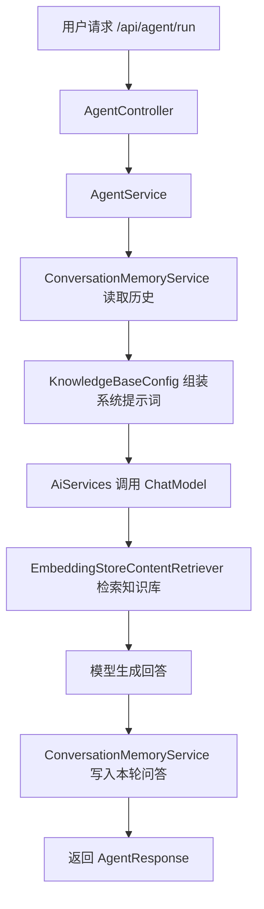

# 记忆功能实现说明

这份笔记记录本项目里的“按 `userId` 存储记忆”是怎么做出来的。它不是单纯的聊天记录保存，而是把每个用户最近的对话当作上下文，再和 RAG 检索结果一起交给大模型。

## 1. 这个功能要解决什么问题

RAG 能解决“让模型回答你知识库里的资料”，但它记不住“同一个用户上次聊到了哪儿”。

所以这次加了一个记忆层，目标是：

- 不同用户的对话互相隔离
- 同一个 `userId` 再来时，能接着上次的话题继续聊
- 模型回答时，能参考用户最近几轮历史对话
- 记忆数据落到 PostgreSQL，而不是只存在内存里

---

## 2. 总体实现思路

当前记忆功能的核心思路是：

1. 用户请求里带上 `userId`
2. 程序先去数据库查这个用户最近的对话
3. 把最近几轮对话拼成一段“记忆上下文”
4. 把这段上下文放进系统提示词里
5. 再把用户当前问题交给模型
6. 模型回答后，把本轮问答再写回数据库

也就是说，它不是“模型自己自动记住”，而是：

- 程序负责存
- 程序负责取
- 程序负责把记忆喂给模型

---

## 3. 整体流程



---

## 4. 代码是怎么接起来的

### 4.1 请求体里增加 `userId`

现在接口请求体不是只传 `task`，而是要传：

- `userId`
- `task`

对应代码在：

- [AgentRequest.java](C:\Users\86187\Desktop\老桌面\学习笔记\Java学习\大三暑假\agent_demo\springboot-refactor\src\main\java\com\antropath\minimalagent\api\AgentRequest.java)

它的结构是：

```java
public record AgentRequest(
        String userId,
        String task
) {}
```

这样做的原因很简单：

- `userId` 用来区分不同用户
- `task` 是当前这一轮的问题

### 4.2 Controller 只做转发

对应代码在：

- [AgentController.java](C:\Users\86187\Desktop\老桌面\学习笔记\Java学习\大三暑假\agent_demo\springboot-refactor\src\main\java\com\antropath\minimalagent\api\AgentController.java)

Controller 里只做一件事：

```java
return new AgentResponse(agentService.answer(request));
```

它不关心记忆怎么存、RAG 怎么检索，只负责收请求和返回结果。

### 4.3 Service 负责“先问模型，再写记忆”

对应代码在：

- [AgentService.java](C:\Users\86187\Desktop\老桌面\学习笔记\Java学习\大三暑假\agent_demo\springboot-refactor\src\main\java\com\antropath\minimalagent\agent\AgentService.java)

逻辑是：

```java
String answer = assistant.chat(request);
conversationMemoryService.recordExchange(request.userId(), request.task(), answer);
return answer;
```

这里的顺序很重要：

1. 先让模型回答
2. 再把本轮问答写入数据库

这样下一次同一个用户来时，就能读到上一轮内容。

---

## 5. 记忆是怎么存到数据库里的

### 5.1 表实体

对应代码在：

- [UserConversationMessage.java](C:\Users\86187\Desktop\老桌面\学习笔记\Java学习\大三暑假\agent_demo\springboot-refactor\src\main\java\com\antropath\minimalagent\memory\UserConversationMessage.java)

这个实体对应数据库表 `user_conversation_message`，字段如下：

- `id`：主键，自增
- `userId`：用户 id
- `role`：消息角色，用户或助手
- `content`：消息内容
- `createdAt`：创建时间

### 5.2 仓库

对应代码在：

- [UserConversationMessageRepository.java](C:\Users\86187\Desktop\老桌面\学习笔记\Java学习\大三暑假\agent_demo\springboot-refactor\src\main\java\com\antropath\minimalagent\memory\UserConversationMessageRepository.java)

这里定义了一个按用户取最近消息的方法：

```java
List<UserConversationMessage> findTop12ByUserIdOrderByCreatedAtDesc(String userId);
```

意思是：

- 每次最多取 12 条
- 按时间倒序

### 5.3 记忆服务

对应代码在：

- [ConversationMemoryService.java](C:\Users\86187\Desktop\老桌面\学习笔记\Java学习\大三暑假\agent_demo\springboot-refactor\src\main\java\com\antropath\minimalagent\memory\ConversationMemoryService.java)

它做两件事：

#### 读取记忆

```java
public String buildMemoryContext(String userId)
```

流程是：

- 查出这个 `userId` 最近 12 条消息
- 把时间倒序的结果再反转回来
- 拼成一段文本
- 返回给模型当上下文

#### 写入记忆

```java
public void recordExchange(String userId, String task, String answer)
```

它会写两条记录：

- 一条 `用户`
- 一条 `助手`

这样数据库里就能保留完整对话轨迹。

---

## 6. 记忆是怎么喂给模型的

真正把“记忆”接到 AI 服务里的地方在：

- [KnowledgeBaseConfig.java](C:\Users\86187\Desktop\老桌面\学习笔记\Java学习\大三暑假\agent_demo\springboot-refactor\src\main\java\com\antropath\minimalagent\agent\KnowledgeBaseConfig.java)

核心代码是：

```java
return AiServices.builder(Assistant.class)
        .chatModel(chatModel)
        .contentRetriever(knowledgeContentRetriever)
        .systemMessageProviderWithContext(context -> {
            AgentRequest request = extractRequest(context);
            String memoryContext = conversationMemoryService.buildMemoryContext(request.userId());
            return """
                    你是一个中文学习助手，同时支持知识库问答和用户记忆。
                    1. 优先根据检索到的知识库内容回答。
                    2. 同一个 userId 的历史对话记忆如下：
                    %s
                    3. 如果知识库中没有相关资料，请明确说明。
                    4. 回答尽量准确、自然、简洁。
                    """.formatted(memoryContext);
        })
        .userMessageProvider(input -> {
            if (input instanceof AgentRequest request) {
                return request.task();
            }
            if (input instanceof String task) {
                return task;
            }
            return String.valueOf(input);
        })
        .build();
```

这里的意思是：

- `contentRetriever` 负责找知识库片段
- `systemMessageProviderWithContext` 负责把用户历史对话拼进系统提示词
- `userMessageProvider` 负责把当前问题送给模型

所以模型最终拿到的是：

- 当前问题
- 知识库检索结果
- 该用户的历史对话

而不是直接拿数据库里的表去推理。

---

## 7. 数据库配置

配置在：

- [application.yml](C:\Users\86187\Desktop\老桌面\学习笔记\Java学习\大三暑假\agent_demo\springboot-refactor\src\main\resources\application.yml)

关键项是：

```yaml
spring:
  datasource:
    url: jdbc:postgresql://${DB_HOST:localhost}:${DB_PORT:5432}/${DB_NAME:agentdemo}
    username: ${DB_USERNAME:postgres}
    password: ${DB_PASSWORD:}
  jpa:
    hibernate:
      ddl-auto: update
```

这表示：

- 数据库默认连 `agentdemo`
- 默认用户名是 `postgres`
- 密码从环境变量 `DB_PASSWORD` 里取
- `ddl-auto: update` 会在启动时自动建表或更新表结构

所以这次学习项目里**不需要手动建表**。

---

## 8. 为什么会出现 500 错误

这次记忆功能刚接上的时候，出现过一个典型报错：

```text
ClassCastException: class java.lang.String cannot be cast to class AgentRequest
```

这个问题的根源是：

- 我一开始把 `systemMessageProvider` 里的入参当成了 `AgentRequest`
- 但 LangChain4j 实际传进来的是 `String`
- 所以一强转就炸了

最终表现就是：

```json
{
  "timestamp": "...",
  "status": 500,
  "error": "Internal Server Error",
  "path": "/api/agent/run"
}
```

这个 `500` 只是 Spring Boot 返回的错误壳子，真正的原因在日志里的 `ClassCastException`。

---

## 9. 问题是怎么解决的

最后的修法是：

### 9.1 不再直接强转 `String`

改成使用：

```java
systemMessageProviderWithContext(...)
```

然后从 `InvocationContext` 里取方法参数。

### 9.2 从上下文里拿 `AgentRequest`

代码里加了一个辅助方法：

```java
private static AgentRequest extractRequest(InvocationContext context)
```

它会从：

```java
context.methodArguments()
```

里取出第一个参数，再转成 `AgentRequest`。

### 9.3 `userMessageProvider` 也做了容错

当前写法会兼容：

- `AgentRequest`
- `String`
- 其他对象转字符串

这样就不容易再因为 LangChain4j 的入参形式变化而炸掉。

---

## 10. 这个记忆功能现在的特点

现在这套记忆功能属于：

- **按用户隔离**
- **落库持久化**
- **最近对话上下文记忆**
- **和 RAG 同时工作**

它不是特别复杂的“长期人格记忆”，而是更实用的：

- 记住上次聊到哪里
- 记住这个用户最近关心什么
- 回答时带上历史上下文

很适合学习项目和中小型问答系统。

---

## 11. 如何验证它真的生效了

最简单的验证方式是连续发两次请求，保持同一个 `userId`。

第一次：

```json
{
  "userId": "u001",
  "task": "以后回答我时尽量简洁一点"
}
```

第二次：

```json
{
  "userId": "u001",
  "task": "Spring Boot 自动配置是什么？"
}
```

如果记忆生效，第二次回答会更容易带上第一次的风格或上下文。

你也可以去数据库里查：

```sql
select * from user_conversation_message
order by created_at desc;
```

如果看到同一个 `userId` 下面有 `用户` 和 `助手` 两类记录，就说明已经写库了。

---

## 12. 这次实现的核心结论

一句话总结：

**这份记忆功能不是模型自己“天生会记”，而是程序把历史对话从 PostgreSQL 里取出来，再作为上下文交给模型。**

它的关键点分别是：

- 请求里带 `userId`
- 数据库存对话
- 服务层读写记忆
- `AiServices` 负责把记忆和知识库一起送给模型
- 模型只负责生成答案

---

## 13. 后面可以继续扩展的方向

如果你后面还想继续做，可以往这些方向扩：

- 只保存摘要，不保存全部原文
- 给记忆加过期时间
- 按用户画像区分“学习型记忆”和“偏好型记忆”
- 给回答加来源说明
- 把最近对话和知识库检索结果分开标注

这个项目已经有一个挺好的基础了，后面可以继续慢慢长出来。

