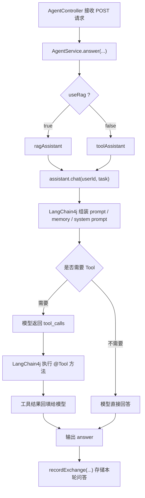

# 今天问答整理

本文把今天围绕 LangChain4j、记忆、RAG、Tool 调用这几件事的提问和结论整理一下，方便后面回看。

## 1. `assistant.chat(...)` 和 `recordExchange(...)` 的先后顺序

你的核心疑问是：为什么代码里先调用 `assistant.chat(request.userId(), request.task())`，后调用 `conversationMemoryService.recordExchange(...)`，这样会不会导致历史消息没法拼进去。

结论是：**不会。**

原因是：

1. `assistant.chat(...)` 才是本轮请求真正进入 LangChain4j 的入口。
2. 在 `chat(...)` 执行过程中，框架会先读取：
   - `@MemoryId`
   - `@UserMessage`
   - `systemMessageProvider(...)`
   - `chatMemoryProvider(...)`
   - `contentRetriever(...)`
   - `tools(...)`
3. 你的 `recordExchange(...)` 是在模型已经返回 `answer` 之后才执行的，所以它影响的是**下一轮对话**，不是当前这轮。

换句话说：

- `chat(...)`：读历史、组 prompt、发给模型
- `recordExchange(...)`：把这轮问答写入数据库

## 2. `systemMessageProvider(...)` 到底调用哪个方法

你问过这行代码：

```java
.systemMessageProvider(userId -> buildToolSystemMessage((String) userId, conversationMemoryService))
```

这里不是 LangChain4j 去“猜”要运行哪个方法，而是你已经明确把一个 lambda 传给它了。

它的含义是：

1. 框架拿到 `userId`
2. 调用你传入的函数
3. 这个函数内部再去执行 `buildToolSystemMessage(...)`

所以真正运行的是你写死的 `buildToolSystemMessage(...)`，不是框架自动选择。

## 3. `Assistant.class` 是什么作用

```java
AiServices.builder(Assistant.class)
```

这里的作用是告诉 LangChain4j：

- 我要生成一个 `Assistant` 接口的代理实现
- 这个接口里的方法，比如 `chat(@MemoryId String userId, @UserMessage String task)`，以后都由框架拦截处理

所以它不是“指定一个类去执行”，而是“指定一个代理接口，让框架接管这个接口的方法调用”。

## 4. `@Qualifier("toolAssistant")` 的作用

这个注解是用来区分 Spring 里同类型的 Bean 的。

你这里有两个 `Assistant` Bean：

- `ragAssistant`
- `toolAssistant`

它们类型一样，Spring 看到 `Assistant` 时不知道该注入哪一个，所以用：

```java
@Qualifier("ragAssistant")
@Qualifier("toolAssistant")
```

来明确指定。

## 5. Tool 调用在哪里发生

你还问了 `webSearch` 到底在哪里调用。

结论是：**不是你手动调用，也不是 `AgentService` 里直接调用，而是模型决定后，由 LangChain4j 执行。**

工具定义在这里：

```java
@Tool("Search the web and return a short list of relevant results with titles, URLs, and snippets.")
public String webSearch(String query)
```

然后在 `toolAssistant` 里注册：

```java
.tools(minimalAgentTools)
```

执行流程是：

1. `assistant.chat(userId, task)` 进入 `toolAssistant`
2. 模型先看系统提示词和用户问题
3. 如果模型认为需要搜索，就返回 `tool_calls`
4. LangChain4j 解析 `tool_calls`
5. 反射执行 `MinimalAgentTools.webSearch(...)`
6. 把工具返回结果再喂回模型
7. 模型生成最终答案

所以 Tool 调用是“模型先决定，框架后执行”。

## 6. 今天你梳理出来的完整主链路



## 7. 最终结论

你今天得到的最关键结论可以浓缩成一句话：

**Controller 收请求，Service 选 assistant，LangChain4j 负责组装 prompt、记忆、RAG 和 Tool 调用，模型返回答案后再把本轮对话落库。**

这意味着：

- 历史消息不是在 `recordExchange(...)` 里拼进去的
- `systemMessageProvider(...)` 是你自己决定用哪个方法生成系统提示词
- `@Tool` 的方法是由模型触发、框架执行的
- `@Qualifier` 是为了区分同类型 Bean


我懂了，现在这个流程是这样的，首先启动的入口在agentcontroller，这里传入的是post请求的包括用户输入的消息在内的所有信息，然后调用agentService.answer方法，这个方法里面通过参数选择==assistant的类型是rag还是Tool类型，这两种assistant都定义在KnowledgeBaseConfig里面，然后调用assistant中的chat方法==，会根据assistant定义的构造方法自动完成流程请求得到answer，然后调用存储函数进行存储。这里的构造assistant里面会传入多种参数，就包括了自动调用memory函数得到记忆的方法     ，Tool的调用也构建的assistant流程里面


`chat` 是你定义的 AI 服务入口；两个参数分别代表“记忆 ID”和“用户问题”；写成接口是因为 LangChain4j 会根据接口和注解动态生成实现类。
